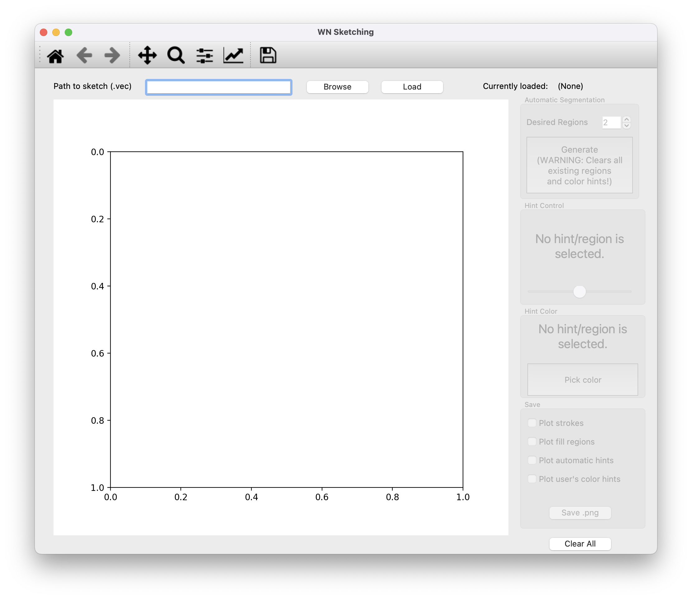

# Winding Number Features for Vector Sketch Colorization

Authors: [Daniel Scrivener](http://scrivener.studio), [Ellis Coldren](http://especiallyellis.com/), [Edward Chien](https://cs-people.bu.edu/edchien/)


This repository implements the method described in ["Winding Number Features for Vector Sketch Colorization."](http://scrivener.studio/winding)
[Paper Download (.pdf, 7.3 MB)](http://scrivener.studio/files/winding.pdf)

## Setup

### 0. If on Windows, install WSL

Windows Subsystem for Linux (WSL) is the recommended way to run the code for Windows users. Follow the provided instructions: https://learn.microsoft.com/en-us/windows/wsl/install

In all subsequent steps, use the WSL "Ubuntu" terminal to run commands.

### 1. Clone the repository
In your terminal:
```
git clone https://github.com/biurci-scrivener/wn-sketch-features.git
```

### 2. Compile C modules
These modules are pretty barebones and should compile in virtually any Unix environment. In your terminal, navigate to the repository folder with `cd windingsketch-public-dev` and run the following commands 
```
cd libs
make
```

### 3. Download and compile Triangle

[Triangle](https://www.cs.cmu.edu/~quake/triangle.html) is a robust 2D Delaunay triangulation library by Jonathan Shewchuk. 

First, download the latest version: http://www.netlib.org/voronoi/triangle.zip and extract it into the respository folder. The extracted folder must be named "triangle."

#### If you're building on macOS:

- In `makefile`, change the following:
    - `CC = cc` $\to$ `CC = clang`
    - Remove the `-DLINUX` flag from `CSWITCHES = -O -DLINUX -I/usr/X11R6/include -L/usr/X11R6/lib`

Finally, in your terminal, navigate to the folder containing the Triangle source code and run `make triangle`. You should now have an executable named `triangle` in the folder.

### 4. Install necessary Python packages

The necessary Python packages are listed in requirements.txt and can be installed with `pip` as follows:

```
pip install -r requirements.txt
```

It is recommended to install these into a virtual/conda environment with Python version 3.9. If you're new to Python environments, I recommend miniforge ([download](https://github.com/conda-forge/miniforge), [getting started with conda](https://conda.io/projects/conda/en/latest/user-guide/getting-started.html)).

### 5. Done!

To run the program, simply navigate to the root of the project repository and run

```
python main.py
```

or, depending on your system's environment variables

```
python3 main.py
```

(Make sure that the correct environment has been activated, if applicable!)

## Using the Program

Running `main.py` presents the user with the following interface:



Sketches shown in our work can be downloaded here: [Data (.zip, 1.9 MB)](https://scrivener.studio/files/wnf_sketches.zip)

You can load one of these sample sketches or supply your own in the .vec format. [VPaint](https://www.vpaint.org/) saves sketches of this format (and will let you convert .svg files to .vec). 

Click/draw directly on the plot to provide color hints. Clicking and releasing immediately creates a point; clicking and dragging creates a "scribble." 

TIP: For your first hint, click anywhere outside the sketch to tell the program where the "background" is.

Press the button labelled "Generate" to initialize $k$ color regions automatically. (This will clear any existing hints/color regions.)

Hints can be selected by clicking on them (they will be highlighted in green). Once you've selected a hint, you can change its color or the "strength" slider associated with the hint. The strength can also be modified by scrolling the mouse/trackpad.

## Troubleshooting

### Error loading C modules (`tv.so, winding.so`)

- If you get an error along the lines of `OSError: dlopen(.../winding.so): tried '...' (no such file)`
    - You may not have compiled the C modules properly in Step 2. Run `make` in the `libs` folder and ensure that the following files exist in your project folder:
        - libs/tv.so
        - libs/winding.so
- If you get an error along the lines of `OSError: dlopen(.../winding.so): tried '...' (mach-o file, but is an incompatible architecture (have 'arm64', need 'x86_64'))`
    - You own an Apple Silicon Mac, but you have an Intel version of Python installed. Send me a message and I'll be happy to help!

### Error loading Triangle

- If you get an error along the lines of `FileNotFoundError: [Errno 2] No such file or directory: './triangle/triangle'`
    - Make sure that you've downloaded and compiled Triangle as described in Step 3. The executable's path is hard-coded relative to the root of the repository: it needs to be named "triangle," in a folder named "triangle."

## License

The source for this implementation is released under the MIT license.

All sketches shown in our work are licensed independently of this repository. Please refer to LICENSES.txt in ["wnf_sketches.zip"](https://scrivener.studio/files/wnf_sketches.zip) (1.9 MB) for detailed license information.

## Citation

```
@article{scrivener24winding,
    journal = {Computer Graphics Forum},
    title = {Winding Number Features for Vector Sketch Colorization},
    author = {Scrivener, Daniel and Coldren, Ellis and Chien, Edward},
    year = {2024},
    publisher = {The Eurographics Association and John Wiley & Sons Ltd.},
    ISSN = {1467-8659},
    DOI = {10.1111/cgf.15141}
}
```
